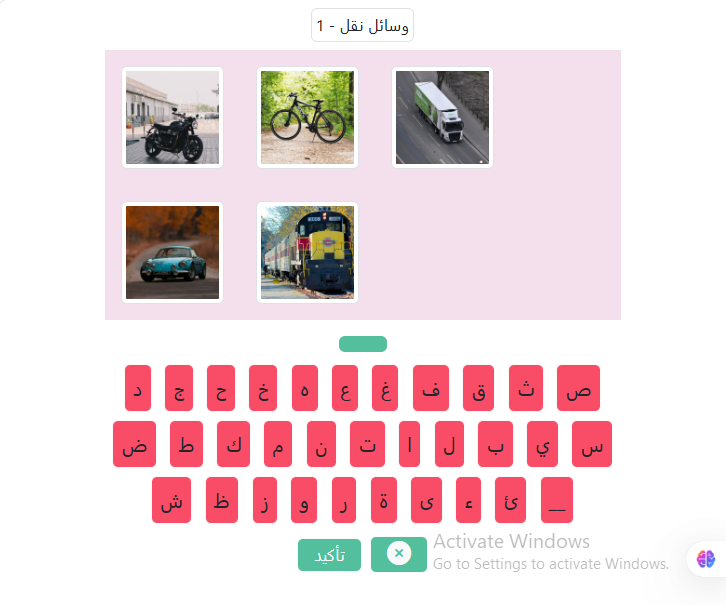

# 🧠 Kalimat – Visual Word Recognition Game

**Kalimat** is an interactive educational web application built with vanilla JavaScript. The game displays a virtual keyboard and a set of images above it. Users are challenged to identify each image and type its name using the on-screen keyboard. It's a fun and engaging way to improve vocabulary, spelling, and visual recognition skills.

---

## 🎯 Concept

The app combines visual learning with active participation. Each round presents several images (e.g., apple, car, dog), and the user must type the correct  word for each using the provided alphabet keyboard. It's ideal for children, language learners, and anyone looking to sharpen their vocabulary in a playful way.

---

## 🚀 Features

- 🖼️ Dynamic image display with randomized selections
- ⌨️ Interactive on-screen keyboard with all alphabet letters
- ✅ Real-time word validation and feedback
- 🔁 Refresh and replay functionality
- 📱 Responsive design for mobile and desktop
- 🌐 No external libraries or frameworks – pure HTML, CSS, and JavaScript

---

## 🛠️ Technologies Used

- **HTML5** – Structure and layout
- **CSS3** – Styling and responsiveness
- **Vanilla JavaScript (ES6+)** – Game logic and interactivity

---

## 🎓 Educational Benefits
- Enhances English vocabulary and spelling

- Improves image-word association

- Encourages active learning through play

- Suitable for ESL learners and young students

  ## 🎯 Target Audience
- Language learners

- Children practicing spelling

- Educators seeking interactive tools

- Anyone who enjoys word games

## 🧾 How to Play
- Observe the images displayed above the keyboard.

- Use the on-screen keyboard to type the English name of each image.

- Submit your answer to check if it's correct.

- Continue to the next image or refresh for a new set.
- 
  ## 🙏 Acknowledgments
  
Inspired by the joy of learning through visual interaction. Special thanks to educators and learners who make language learning fun and accessible.

## 📬 Feedback & Contributions
We welcome suggestions, bug reports, and contributions. Feel free to open an issue or submit a pull request via GitHub.
